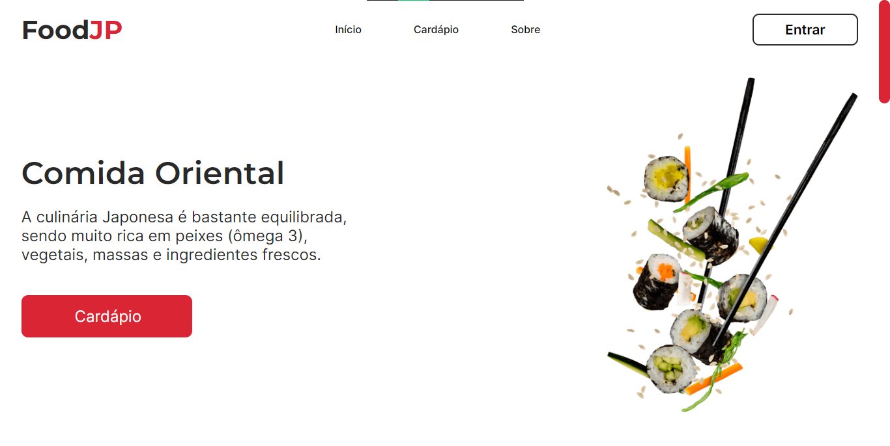
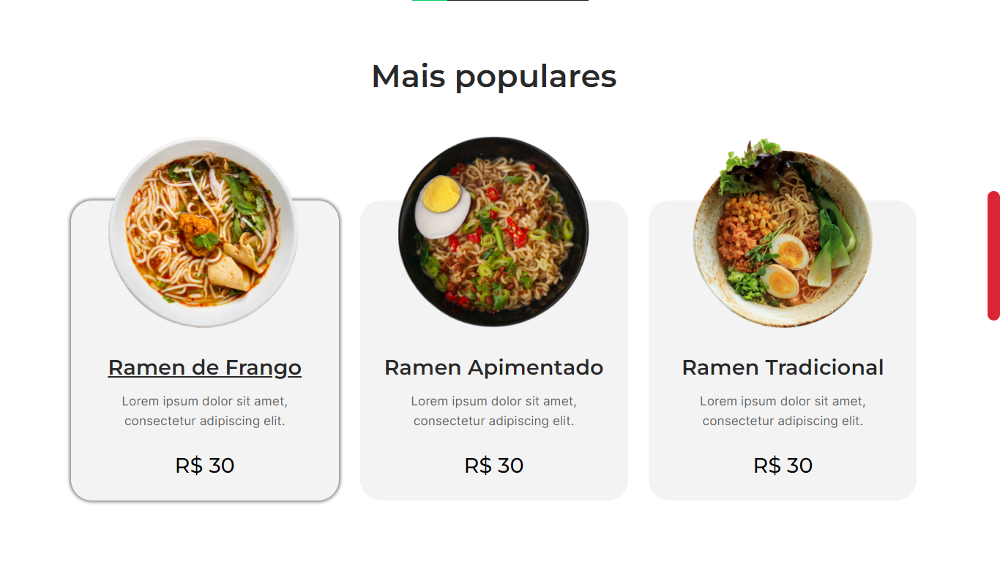
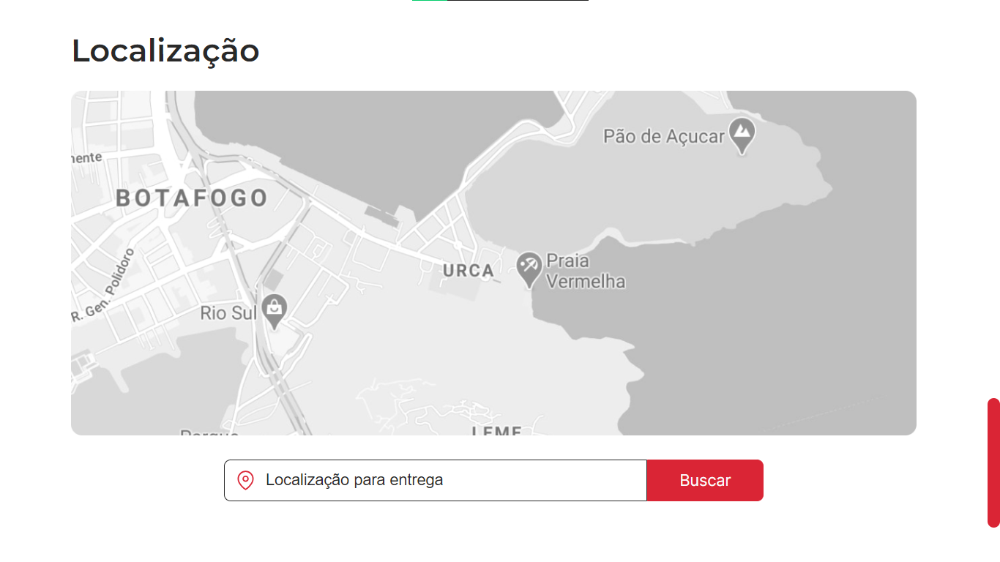

# FoodJP - Comida Oriental

## ❓ Sobre

Lading Page sobre um restaurante de Comida Oriental, que apresenta seus pratos, algumas avaliações e sua localização.

---

## ⭐ Conceitos e Tecnologias

- ReactJS
- ViteJS
- Stitches ( CSS-in-JS )
- TypeScript ( TS )
- GIT
- Gitmoji
- Figma
- Commits semânticos
- Metodologia BEM

---

## 🖥 Visualização

---

---

---

---

---

---

    <a style="color: #195BBD;" href="https://food-jp-restaurant.vercel.app/">Link de Visualização</a>
    
 &copy; Vitor Santos

